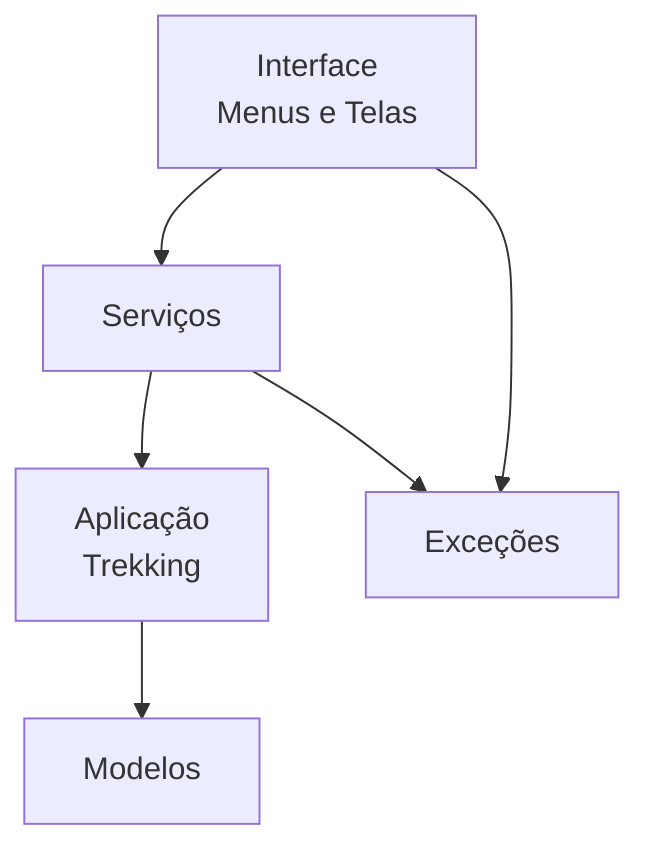

# Arquitetura — Segunda Versão

O projeto de trekking foi refatorado para separar a interface, os serviços,
a aplicação e os modelos. Os dados continuam armazenados em listas na memória.



## Responsabilidades

- **Interface:** lê entradas do usuário, chama serviços e apresenta resultados.
- **Serviços:** concentram operações e regras de negócio.
- **Aplicação:** mantém as coleções internas em memória e oferece operações de armazenamento.
- **Modelos:** representam Corrida, Equipe, Professor, Checkpoint e Passagem.
- **Exceções:** representam situações inválidas previstas pelas regras do domínio.

## Serviços

```text
servicos/
├── corrida_service.py
├── equipe_service.py
├── professor_service.py
├── checkpoint_service.py
├── passagem_service.py
└── dependencias.py
```

A interface não chama mais métodos de negócio diretamente em `Trekking`.
Por exemplo, o registro de uma passagem percorre:

```text
TelaPassagens
      ↓
PassagemService
      ↓
Trekking (dados em memória)
      ↓
Modelos
```

Uma regra inválida também segue a mesma arquitetura:

```text
TelaPassagens
      ↓
PassagemService.registrar()
      ↓
PassagemJaRegistradaError / EquipeNaoParticipanteError / ...
      ↓
Tela captura a exceção e exibe a mensagem
```
