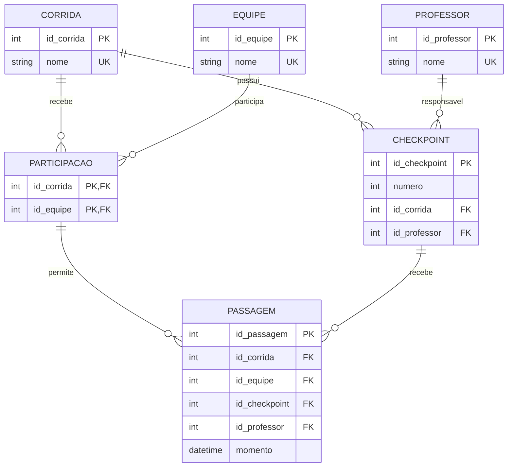

# Sistema de Trekking

Sistema desenvolvido em Python para gerenciamento e acompanhamento de corridas de trekking.

## 👥 Equipe

**Projeto:** Sistema de Trekking
**Turma:** Infoweb 2v

**Integrantes:**

* Pedro Júlio
* Francisco Thalys
* Luiz Guilherme Pereira

## 📌 Sobre o sistema

O Sistema de Trekking tem como objetivo auxiliar na organização de corridas de trekking, permitindo o cadastro e a consulta das principais informações utilizadas durante uma competição.

O sistema permite cadastrar corridas, equipes, professores e checkpoints, além de registrar a participação das equipes nas corridas e suas passagens pelos checkpoints.

Durante a realização de uma corrida, cada checkpoint possui um número e um professor responsável. As equipes são previamente vinculadas às corridas das quais participarão. A partir disso, podem ser registradas as passagens das equipes pelos checkpoints, armazenando também o momento de cada registro.

Dessa forma, o sistema permite acompanhar as corridas e consultar informações relacionadas às equipes, checkpoints, professores e passagens realizadas.

## ⚙️ Principais funcionalidades

* Cadastro de corridas.
* Cadastro de equipes.
* Cadastro de professores.
* Cadastro de checkpoints.
* Vinculação de equipes às corridas.
* Registro de passagem das equipes pelos checkpoints.
* Consulta de corridas, equipes, professores e checkpoints.
* Consulta de passagens por corrida, equipe ou checkpoint.
* Controle para evitar duplicidade de passagem.
* Controle da numeração dos checkpoints dentro de cada corrida.

## 📁 Estrutura do projeto

```text
CheckpointsTrekking/
├── main.py
├── aplicacao.py
├── trekking.py
├── modelos/
├── servicos/
├── excecoes/
├── interface/
├── testes/
└── ARQUITETURA.md
```

O projeto utiliza uma organização em camadas para separar as responsabilidades do sistema:

```text
Interface
    ↓
Serviços
    ↓
Aplicação
    ↓
Modelos
    ↓
Exceções
```

Os dados utilizados pelo sistema permanecem armazenados somente em memória nesta etapa do projeto.

## 🗄️ Modelo lógico do banco de dados

O modelo lógico utilizado como referência para as próximas etapas é composto pelas seguintes relações:

* **CORRIDA** — identifica as corridas cadastradas.
* **EQUIPE** — identifica as equipes participantes.
* **PROFESSOR** — identifica os professores responsáveis.
* **CHECKPOINT** — representa os pontos de controle de uma corrida.
* **PARTICIPACAO** — representa a associação entre equipes e corridas.
* **PASSAGEM** — registra a passagem de uma equipe por um checkpoint.

### Diagrama ER



## 🔑 Relações e restrições

### CORRIDA

```text
CORRIDA(
    id_corrida PK,
    nome UNIQUE
)
```

Cada corrida possui um identificador próprio e seu nome não pode ser repetido.

### EQUIPE

```text
EQUIPE(
    id_equipe PK,
    nome UNIQUE
)
```

Cada equipe possui um identificador próprio e seu nome não pode ser repetido.

### PROFESSOR

```text
PROFESSOR(
    id_professor PK,
    nome UNIQUE
)
```

Cada professor possui um identificador próprio e seu nome não pode ser repetido.

### CHECKPOINT

```text
CHECKPOINT(
    id_checkpoint PK,
    numero,
    id_corrida FK → CORRIDA.id_corrida,
    id_professor FK → PROFESSOR.id_professor,
    UNIQUE(id_corrida, numero)
)
```

Cada checkpoint pertence a uma única corrida e possui um único professor responsável.

O número do checkpoint pode existir em corridas diferentes, mas não pode se repetir dentro da mesma corrida.

### PARTICIPACAO

```text
PARTICIPACAO(
    id_corrida PK, FK → CORRIDA.id_corrida,
    id_equipe PK, FK → EQUIPE.id_equipe
)
```

A relação `PARTICIPACAO` resolve o relacionamento muitos-para-muitos entre `EQUIPE` e `CORRIDA`.

Uma equipe pode participar de várias corridas, e uma corrida pode receber várias equipes.

### PASSAGEM

```text
PASSAGEM(
    id_passagem PK,
    id_corrida FK,
    id_equipe FK,
    id_checkpoint FK,
    id_professor FK,
    momento,
    UNIQUE(id_corrida, id_equipe, id_checkpoint)
)
```

`PASSAGEM` representa o registro de uma equipe em um checkpoint de uma corrida.

O registro deve estar relacionado a uma participação existente da equipe na corrida e ao professor responsável pelo checkpoint.

A combinação:

```text
(id_corrida, id_equipe)
```

deve corresponder a uma participação existente em `PARTICIPACAO`.

A combinação:

```text
(id_checkpoint, id_professor)
```

deve corresponder ao professor responsável pelo checkpoint.

Além disso, a combinação:

```text
(id_corrida, id_equipe, id_checkpoint)
```

é única, impedindo que a mesma equipe tenha mais de uma passagem no mesmo checkpoint da mesma corrida.

## 📊 Cardinalidades

As principais cardinalidades do modelo são:

* Uma **corrida** pode possuir de **0 a N checkpoints**, enquanto cada checkpoint pertence a **1 corrida**.
* Um **professor** pode ser responsável por **0 a N checkpoints**, enquanto cada checkpoint possui **1 professor responsável**.
* Uma **equipe** pode participar de **0 a N corridas**.
* Uma **corrida** pode receber **0 a N equipes**.
* Cada registro de `PARTICIPACAO` pertence obrigatoriamente a **1 equipe** e **1 corrida**.
* Uma corrida, equipe, checkpoint ou professor pode existir antes de qualquer passagem.
* Cada `PASSAGEM` está obrigatoriamente relacionada a **1 corrida**, **1 equipe**, **1 checkpoint** e **1 professor**.

## ▶️ Como executar

No diretório do projeto, execute:

```bash
python main.py
```

## 🧪 Testes

Para executar o fluxo de testes:

```bash
python testes/test_fluxo.py
```

Os testes contemplam:

* cadastro de corrida, equipe e professor;
* cadastro de checkpoint;
* participação da equipe na corrida;
* registro de passagem;
* consultas por corrida, equipe e checkpoint;
* tentativa de repetir uma passagem;
* tentativa de registrar passagem de equipe que não participa da corrida.

## 📚 Referência

O diagrama entidade-relacionamento deste README utiliza a sintaxe Mermaid ER Diagram, incorporada diretamente ao Markdown para permitir sua renderização no GitHub.

Documentação oficial do Mermaid:

https://mermaid.js.org/syntax/entityRelationshipDiagram.html
