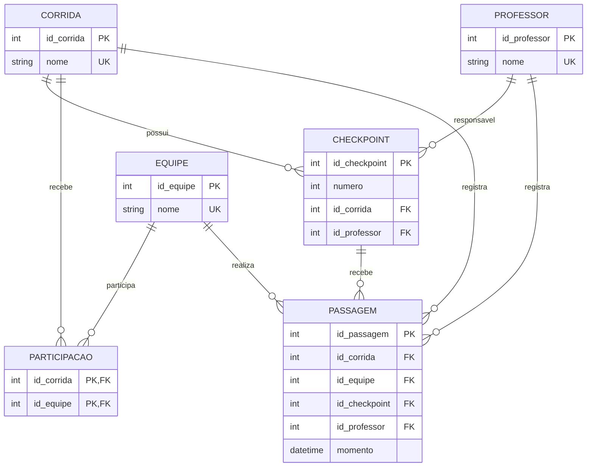

# Sistema de Trekking

Sistema desenvolvido em Python para auxiliar no gerenciamento e acompanhamento de corridas de trekking.

## 👥 Equipe

**Projeto:** Sistema de Trekking  
**Turma:** Infoweb 2v

**Integrantes:**
- Pedro Júlio
- Francisco Thalys
- Luiz Guilherme Pereira

## 📌 Sobre o sistema

O Sistema de Trekking tem como objetivo auxiliar na organização de corridas de trekking, permitindo o cadastro e o acompanhamento das principais informações envolvidas em uma competição.

O sistema permite cadastrar corridas, equipes, professores e checkpoints, além de registrar a participação das equipes nas corridas e suas passagens pelos checkpoints.

Durante uma corrida, cada checkpoint possui um número e um professor responsável. Antes de registrar uma passagem, a equipe deve estar vinculada à corrida. O sistema também verifica se o checkpoint pertence à corrida informada, se o professor é responsável pelo checkpoint e se a mesma equipe já passou por aquele checkpoint.

Atualmente, os dados do sistema são mantidos somente em memória. A estrutura apresentada neste README representa o modelo lógico que servirá como referência para as próximas etapas de implementação do banco de dados.

## ⚙️ Principais funcionalidades

- Cadastro de corridas.
- Cadastro de equipes.
- Cadastro de professores.
- Cadastro de checkpoints.
- Associação de equipes às corridas.
- Registro de passagem das equipes pelos checkpoints.
- Consulta de corridas.
- Consulta de equipes.
- Consulta de professores.
- Consulta de checkpoints.
- Consulta de passagens por corrida, equipe ou checkpoint.
- Controle de nomes duplicados.
- Controle de checkpoints com números duplicados dentro da mesma corrida.
- Controle de passagens duplicadas.
- Validação da participação da equipe antes do registro de uma passagem.
- Validação de que o checkpoint pertence à corrida.
- Validação de que o professor é responsável pelo checkpoint.

## 📁 Estrutura do projeto

```text
CheckpointsTrekking/
├── main.py
├── aplicacao.py
├── trekking.py
├── modelos/
├── servicos/
├── excecoes/
├── interface/
├── testes/
└── ARQUITETURA.md
```

O projeto foi organizado em camadas para separar as responsabilidades do sistema:

```text
Interface
    ↓
Serviços
    ↓
Aplicação
    ↓
Modelos
    ↓
Exceções
```

### Responsabilidades das camadas

- **Interface:** apresenta menus, recebe informações do usuário e exibe os resultados.
- **Serviços:** concentram as operações e as regras de negócio.
- **Aplicação:** mantém as coleções de dados em memória e centraliza o armazenamento durante a execução.
- **Modelos:** representam Corrida, Equipe, Professor, Checkpoint e Passagem.
- **Exceções:** representam situações inválidas previstas pelas regras do sistema.

## 🗄️ Modelo lógico do banco de dados

O modelo lógico abaixo representa a estrutura que será utilizada como referência para a futura implementação do banco de dados.

As principais relações são:

- **CORRIDA:** representa as corridas cadastradas.
- **EQUIPE:** representa as equipes participantes.
- **PROFESSOR:** representa os professores responsáveis pelos checkpoints.
- **CHECKPOINT:** representa os pontos de controle de uma corrida.
- **PARTICIPACAO:** resolve o relacionamento muitos-para-muitos entre equipes e corridas.
- **PASSAGEM:** representa o evento de uma equipe passando por um checkpoint.

## 🔗 Diagrama ER



## 🔑 Estrutura das relações

### CORRIDA

```text
CORRIDA(
    id_corrida PK,
    nome UNIQUE
)
```

Cada corrida possui um identificador próprio e seu nome deve ser único.

### EQUIPE

```text
EQUIPE(
    id_equipe PK,
    nome UNIQUE
)
```

Cada equipe possui um identificador próprio e seu nome deve ser único.

### PROFESSOR

```text
PROFESSOR(
    id_professor PK,
    nome UNIQUE
)
```

Cada professor possui um identificador próprio e seu nome deve ser único.

### CHECKPOINT

```text
CHECKPOINT(
    id_checkpoint PK,
    numero,
    id_corrida FK → CORRIDA.id_corrida,
    id_professor FK → PROFESSOR.id_professor,
    UNIQUE(id_corrida, numero)
)
```

Cada checkpoint pertence obrigatoriamente a uma corrida e possui um professor responsável.

O número do checkpoint pode aparecer em corridas diferentes, mas não pode ser repetido dentro da mesma corrida.

### PARTICIPACAO

```text
PARTICIPACAO(
    id_corrida PK, FK → CORRIDA.id_corrida,
    id_equipe PK, FK → EQUIPE.id_equipe
)
```

A relação `PARTICIPACAO` resolve o relacionamento muitos-para-muitos entre `EQUIPE` e `CORRIDA`.

Uma equipe pode participar de várias corridas e uma corrida pode possuir várias equipes participantes.

### PASSAGEM

```text
PASSAGEM(
    id_passagem PK,
    id_corrida FK,
    id_equipe FK,
    id_checkpoint FK,
    id_professor FK,
    momento,
    UNIQUE(id_corrida, id_equipe, id_checkpoint)
)
```

A relação `PASSAGEM` representa o registro de uma equipe em um checkpoint durante uma corrida.

Além das chaves estrangeiras individuais, o modelo deve considerar as seguintes restrições referenciais:

```text
(id_corrida, id_equipe)
    → PARTICIPACAO(id_corrida, id_equipe)
```

Essa referência garante que uma equipe somente possa registrar uma passagem em uma corrida da qual realmente participa.

Também deve ser garantida a correspondência entre o checkpoint e a corrida:

```text
(id_corrida, id_checkpoint)
    → CHECKPOINT(id_corrida, id_checkpoint)
```

E a correspondência entre o checkpoint e o professor responsável:

```text
(id_checkpoint, id_professor)
    → CHECKPOINT(id_checkpoint, id_professor)
```

Dessa forma, o modelo representa as regras que impedem uma passagem com equipe não participante, checkpoint pertencente a outra corrida ou professor que não seja o responsável pelo checkpoint.

## 📊 Cardinalidades

As cardinalidades representam também a participação mínima e máxima de cada entidade:

- Uma **corrida** pode possuir **0..N checkpoints**, enquanto cada **checkpoint** pertence a **1..1 corrida**.
- Um **professor** pode ser responsável por **0..N checkpoints**, enquanto cada **checkpoint** possui **1..1 professor responsável**.
- Uma **equipe** pode participar de **0..N corridas** e uma **corrida** pode receber **0..N equipes**.
- Cada registro de **PARTICIPACAO** pertence obrigatoriamente a **1..1 corrida** e **1..1 equipe**.
- Uma corrida pode possuir **0..N passagens**.
- Uma equipe pode possuir **0..N passagens**.
- Um checkpoint pode possuir **0..N passagens**.
- Um professor pode estar relacionado a **0..N passagens**.
- Cada **PASSAGEM** está obrigatoriamente associada a **1..1 corrida**, **1..1 equipe**, **1..1 checkpoint** e **1..1 professor**.

As cardinalidades do diagrama utilizam a notação de relacionamento do Mermaid ER Diagram, na qual `||` representa uma ocorrência obrigatória única e `o{` representa zero ou muitas ocorrências.

## 🔒 Principais regras de integridade

O sistema considera as seguintes regras:

1. Corridas, equipes e professores não podem possuir nomes duplicados.
2. Cada checkpoint pertence a uma única corrida.
3. Cada checkpoint possui um único professor responsável.
4. O número do checkpoint não pode se repetir dentro da mesma corrida.
5. Uma equipe pode participar de várias corridas.
6. Uma corrida pode possuir várias equipes.
7. Uma equipe deve estar previamente vinculada à corrida antes que uma passagem seja registrada.
8. O checkpoint utilizado em uma passagem deve pertencer à corrida informada.
9. O professor informado na passagem deve ser o responsável pelo checkpoint.
10. Não pode existir mais de uma passagem da mesma equipe no mesmo checkpoint da mesma corrida.
11. O momento da passagem deve ser armazenado para permitir consultas e acompanhamento do histórico.

As regras relacionadas ao registro de passagens são atualmente verificadas pela camada de serviços da aplicação. Na futura implementação do banco de dados, as restrições referenciais compostas deverão manter essas mesmas regras de integridade.

## ▶️ Como executar

No diretório do projeto, execute:

```bash
python main.py
```

## 🧪 Testes

Para executar os testes:

```bash
python testes/test_fluxo.py
```

Os testes incluem:

- cadastro de corrida, equipe e professor;
- cadastro de checkpoint;
- participação de equipe em corrida;
- registro de passagem;
- consultas de passagens;
- tentativa de repetir uma passagem;
- tentativa de registrar passagem para equipe que não participa da corrida;
- validação de checkpoint e corrida;
- validação de professor e checkpoint.

## 📚 Referência

O diagrama entidade-relacionamento foi desenvolvido utilizando a sintaxe **Entity Relationship Diagram (ER)** do Mermaid e está incorporado diretamente neste arquivo `README.md`.

Documentação oficial do Mermaid:

https://mermaid.js.org/syntax/entityRelationshipDiagram.html
