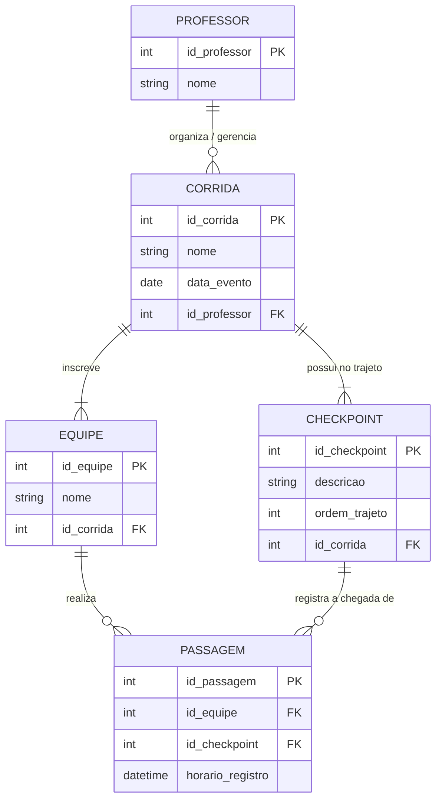

# Sistema de Trekking

Sistema desenvolvido em Python para gerenciamento de corridas de trekking.

## Funcionalidades

- Cadastro de corridas
- Cadastro de equipes
- Cadastro de professores
- Cadastro de checkpoints
- Participação de equipes em corridas
- Registro de passagem das equipes pelos checkpoints
- Consulta de passagens por corrida, equipe ou checkpoint

## Como executar

Execute o arquivo principal:

    python main.py

## Estrutura do projeto

O projeto está organizado em módulos e pacotes, separando os modelos, a interface, as regras da aplicação e as exceções do sistema.

Os principais componentes são:

- `modelos/` → contém as classes de Corrida, Equipe, Professor, Checkpoint e Passagem.
- `interface/` → contém os menus e telas utilizadas para interação com o usuário.
- `excecoes/` → contém as exceções específicas utilizadas pelo sistema.
- `trekking.py` → responsável pelas regras e operações principais da aplicação.
- `main.py` → arquivo responsável por iniciar o sistema.

## Integrantes

Pedro Júlio  
Francisco Thalys  
Luiz Guilherme Pereira

## Diagrama Entidade-Relacionamento

